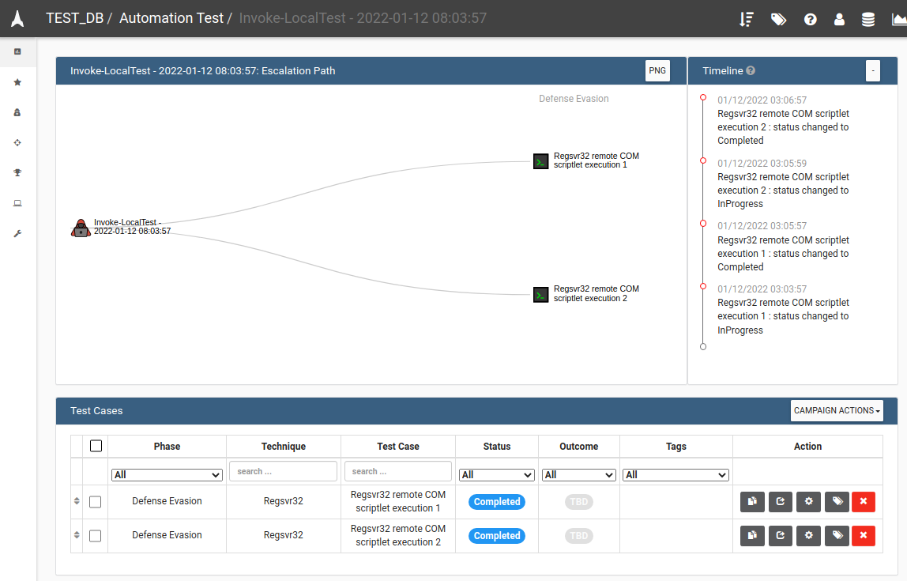

# ATTiRe Structured Logging Format

ATTiRe is Attack Tool Timing and Reporting. This is a machine-readable JSON-formatted superset of useful attack simulation reporting data for content creation and enrichment in tracking tools like VECTR. Use of a structured log format eases the creation of reporting detail and categorization of red team activities.

## Existing Community Logging Formats
Commercial and open source red team operator tools use proprietary logging formats to record the results of adversary emulation and attack simulation. Normalization and translation of this log data can be challenging. We're working with some community projects like Invoke-atomicredteam to build pluggable loggers that capture data to ATTiRe.

## Current Support

### Log Ingestion
* VECTR (https://vectr.io)
# 
# 
# 
# 
### Log Export
* VECTR's (https://vectr.io) portable executable attack automation components log to the ATTiRe format out of the box.
* SRA Invoke-atomicredteam ATTiRe Logger (https://github.com/SecurityRiskAdvisors/invoke-atomic-attire-logger)

### Log / Report Conversion
* Caldera to ATTiRe converter

## Future Goals
* atomic-operator modular ATTiRe logger (in testing)
* Python ATTiRe logging library 
* UBJSON support - https://json.nlohmann.me/features/binary_formats/ubjson/
  * For embedding binary data like videos and screenshots rather than BASE64-encoding
* Attack success / fail data

## ATTiRe Sample
```js
{
    "attire-version": "1.1",
    "execution-data": {
        "execution-command": "Invoke-AtomicTest T1218.010 -TestNames \"Regsvr32 remote COM scriptlet execution\",\"Regsvr32 local DLL execution\"",
        "execution-id": "3im2GxwX9VG8jzXLTDegLEKY8WfrA1IXL0VUwhlDYWs=",
        "execution-source": "Invoke-Atomicredteam",
        "execution-category": {
            "name": "Atomic Red Team",
            "abbreviation": "ART"
        },
        "target": {
            "host": "WINDEV2009EVAL",
            "ip": "192.168.204.129",
            "path": "PATH=C:\\Windows\\system32;C:\\Windows",
            "user": "User"
        },
        "time-generated": "2021-10-27T02:00:57.439Z"
    },
    "procedures": [
        {
            "procedure-name": "Regsvr32 remote COM scriptlet execution",
            "procedure-description": "Run an exe on user logon or system startup.  Upon execution, success messages will be displayed for the two scheduled tasks. To view\nthe tasks, open the Task Scheduler and look in the Active Tasks pane.",
            "procedure-id": {
                "type": "guid",
                "id": "c9d0c4ef-8a96-4794-a75b-3d3a5e6f2a36"
            },
			"mitre-technique-id": "T1218.010",
            "order": 1,
            "steps": [
                {
                    "command": "powershell.exe -File \"T1218010 - Regsvr32 remote COM scriptlet execution\"",
                    "executor": "POWERSHELL",
                    "order": 1,
                    "output": [
                        {
                            "content": "File C:\\Users\\User\\Desktop\\AEv1.0 - Administrator-10\\T1218010 - Regsvr32 remote COM scriptlet executio.ps1 cannot be \r\nloaded. The file C:\\Users\\User\\Desktop\\AEv1.0 - Administrator-10\\T1218010 - Regsvr32 remote COM scriptlet executio is not digitally signed. You cannot run this script on the current system. For more information \r\nabout running scripts and setting execution policy, see about_Execution_Policies at \r\nhttps:/go.microsoft.com/fwlink/?LinkID=135170.\r\n    + CategoryInfo          : SecurityError: (:) [], ParentContainsErrorRecordException\r\n    + FullyQualifiedErrorId : UnauthorizedAccess",
                            "level": "STDERR",
                            "type": "console"
                        }
                    ],
                    "time-start": "2021-10-27T02:02:23.000Z",
                    "time-stop": "2021-10-27T02:02:25.000Z"
                }
            ]
        }
    ]
}
```

## Description of Contents

### Versioning
This refers to ATTiRe v1.1. Subsequent foundational changes will lead to an increase in the ATTiRe version number.

### Execution Data

Execution data in ATTiRe represents an execution event. For a portable executable or disposable script emulating a single procedure or a series of TTP's, this includes information related to the command run to trigger the execution and the active environment.

* **execution-command**: the command run to trigger the execution event
* **execution-id**: a unique identifier for the execution event, usually a random string meant to help dedupe attack logs
* **execution-source**: metadata describing the source of the execution. Typically used by the log consumer to name a campaign.  examples: Invoke-atomicredteam, Cobalt Strike, Powershell Empire
* **execution-category**: (optional) metadata describing the category of all tests being run. This may be used by the log consumer to modify or provide additional detail to procedure names for long-term reference purposes like creating templates.
  * **name**: name for an execution category
  * **abbreviation**: abbreviation for an execution category. May be used by log consumer to prefix generated procedure templates. Example: an abbreviation of "PRE" might create a procedure template of "PRE - Procedure1" for a procedure named "Procedure1"
* **target**: target metadata for the execution event. A target may be something like information about a host where procedures are run or a web URL for a target application.
  * **host**: hostname where execution event was targeted
  * **ip**: IP address where execution event was targeted 
  * **path**: (optional) path information on the execution target
  * **user**: (optional) username of running user on execution target
* **time-generated**: the time this logfile was generated

### Procedures

Procedures represent a specific and reproducible instance of an attack that may be categorized by one or more MITRE Technique IDs. Many procedures may be categorized by a single MITRE Technique ID, and a procedure may be categorized by multiple MITRE Technique IDs. For testing clarity, it helps if there is a primary MITRE Technique ID representing the action being performed.

* **procedure-name**: a preferably unique name for the procedure being executed. Naming is more important than it seems. Noting proper specificity in the type of execution being performed makes it easier to prepare defenses for the exact type of attack and gather intelligence on other similar attacks you may want to test. 
> Bad name example: "WMI Exec" 
> 
> Good name example: "WMI Exec using WMIC.exe with os get /format flags"
> 
> Coverage and testing against the badly named procedure could lead to a false sense of security for other types of WMI execution attacks.
* **procedure-description**: a longer form description of the procedure being executed
* **procedure-id**: unique identifier for a specific procedure. This helps to identify the procedure being run over time for historical tracking of results
  * **type**: the type of procedure ID, currently log consumers only support GUID
  * **id**: the procedure ID contents
* **mitre-technique-id**: the primary mitre technique id for this procedure
* **order**: (optional) the order this procedure was ran in the list of procedures
* **steps**: a list of steps executed within the described procedure
  * **command**: the command for the current step. Example: may be a command line execution like cmd.exe /c ipconfig
  * **executor**: a string representing the executor for the current step. If intended to be reproducible, should match expected enumerated values by consuming tool
  * **order**: An integer value to inform th enumbering of this command step
  * **time-start**: ISO-8601 timestamp in UTC representing the start time of the command. Example: "2021-10-27T02:02:23.000Z"
  * **time-stop**: ISO-8601 timestamp in UTC representing the stop time of the command. Example: "2021-10-27T02:02:25.000Z"
  * **output**: Output entries from the current command
    * **content**: String content output from the current command, may include encoded data like base64 depending on the consuming application
    * **level**: The level of logging content - typically STDERR / STDOUT for console, could be INFO, ERROR, WARN for applications
    * **type**: The type of command step output. Example: "console"
